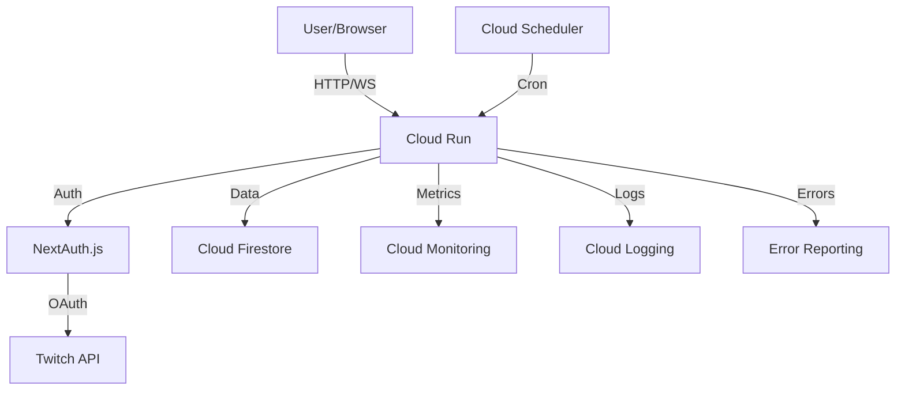

# System Architecture

## Overview

The Twitch VIP Manager is a cloud-native application built with Next.js and deployed on Google Cloud Run. It uses a microservices architecture with serverless components for scalability and maintainability.

## Components

### Frontend
- **Framework**: Next.js 14 with App Router
- **UI Components**: Custom components with Tailwind CSS
- **State Management**: React Context and Server Components
- **Real-time Updates**: WebSocket connections

### Backend
- **API Layer**: Next.js API Routes
- **Authentication**: NextAuth.js with Twitch OAuth
- **Database**: Cloud Firestore
- **Job Scheduler**: Google Cloud Scheduler
- **WebSocket Server**: Custom implementation with `ws` package

### Infrastructure
- **Hosting**: Google Cloud Run
- **Container Registry**: Google Container Registry
- **Monitoring**: Google Cloud Operations
- **CI/CD**: GitHub Actions

## Data Flow



## Database Schema

### Collections

#### users
```typescript
interface User {
  id: string;              // Twitch user ID
  username: string;        // Twitch username
  accessToken: string;     // Encrypted Twitch access token
  refreshToken: string;    // Encrypted Twitch refresh token
  expiresAt: Timestamp;   // Token expiration
}
```

#### channels
```typescript
interface Channel {
  id: string;              // Twitch channel ID
  ownerId: string;         // Channel owner's Twitch ID
  channelPointRewardId: string;  // Channel point reward ID
  vipDuration: number;     // VIP duration in hours
  enabled: boolean;        // Whether VIP management is enabled
}
```

#### vipSessions
```typescript
interface VIPSession {
  id: string;             // Session ID
  channelId: string;      // Channel ID
  userId: string;         // VIP user ID
  username: string;       // VIP username
  grantedAt: Timestamp;  // When VIP was granted
  expiresAt: Timestamp;  // When VIP expires
  redeemedWith: string;   // How VIP was redeemed
}
```

## Security

### Authentication Flow
1. User initiates Twitch OAuth
2. NextAuth.js handles OAuth flow
3. Tokens stored encrypted in Firestore
4. Session cookie used for client auth
5. Middleware validates all requests

### API Security
- CORS configuration
- Rate limiting
- Input validation
- Security headers
- CSRF protection

## Monitoring & Observability

### Custom Metrics
- Active VIP sessions
- VIP grants/removals
- WebSocket connections
- API response times

### Logging
- Structured logging
- Request tracing
- Performance metrics
- Error tracking

### Alerts
- Error rate thresholds
- API latency
- Resource utilization
- Authentication failures

## Deployment

### CI/CD Pipeline
1. Code pushed to GitHub
2. GitHub Actions triggered
3. Tests and linting run
4. Docker image built
5. Image pushed to GCR
6. Deployed to Cloud Run

### Environment Variables
```
NEXT_PUBLIC_TWITCH_CLIENT_ID=
TWITCH_CLIENT_SECRET=
NEXTAUTH_SECRET=
NEXTAUTH_URL=
GOOGLE_CLOUD_PROJECT=
CRON_SECRET=
```

## Scaling

### Auto-scaling Configuration
- Min instances: 0
- Max instances: 10
- CPU utilization target: 80%
- Concurrent requests per instance: 80

### Resource Limits
- Memory: 512MB
- CPU: 1 vCPU
- Request timeout: 60s

## Disaster Recovery

### Backup Strategy
- Firestore daily backups
- Configuration version control
- Automated rollback capability

### Recovery Procedures
1. Restore from latest backup
2. Redeploy stable version
3. Verify data integrity
4. Resume operations 